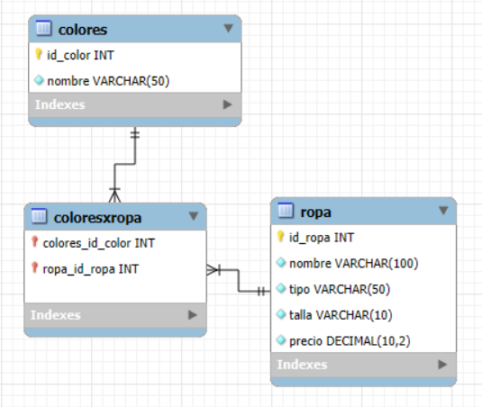

[Evidencia](evidencia.pdf)

Para el modelo proporcionado:

cree los modelos necesarios con sus respectivas relaciones
cree seeder para ingresar al menos 10 colores: ['Rojo', 'Azul', 'Negro', 'Blanco', 'Verde', 'Amarillo', 'Gris', 'Naranja', 'Morado', 'Rosa', 'Marrón', 'Turquesa', 'Beige', 'Violeta', 'Celeste']
cree seeder para ingresar al menos 3 artículos ropa con al menos 2 colores diferentes.
Genere consultas de ropa:
por id [muestra un solo servicio- use una vista adecuada]
por rango de precios[muestre en una tabla]
todo [muestre en una tabla]
Implemente un menú para navegar entre las diferentes opciones.
use partial layouts y bootstrap en su diseño. Divida su pantalla en al menos 4 secciones para encabezado, menú, contenido y footer [datos del examen-desarrollador].